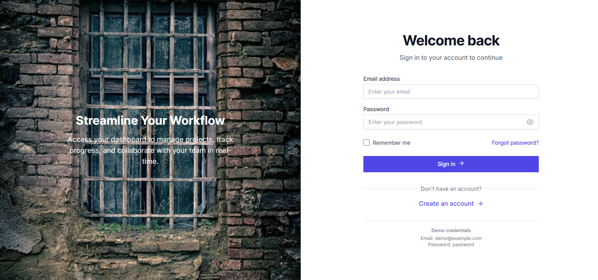
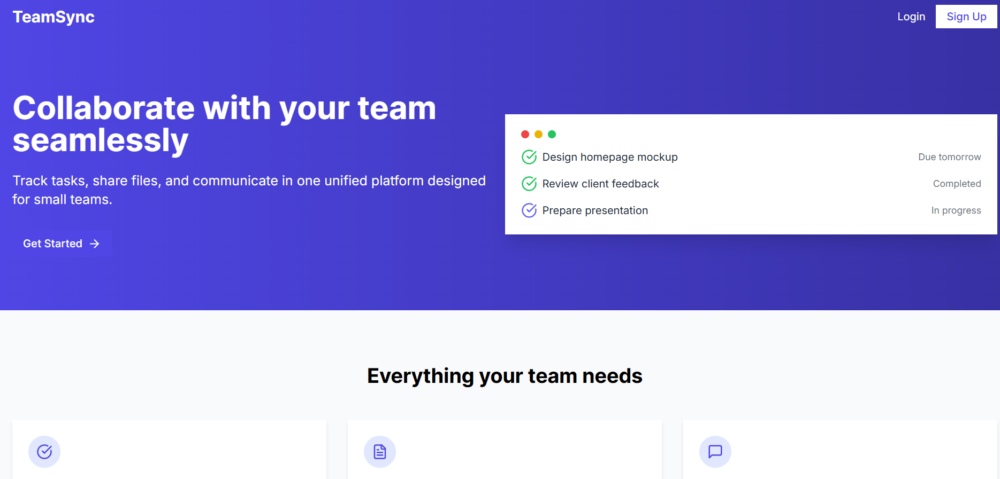
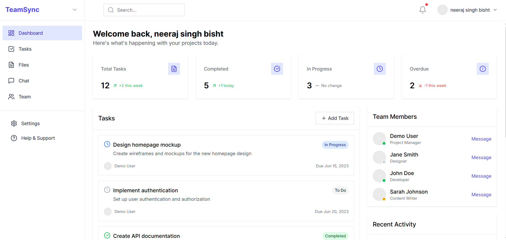

# 🧑‍💻 Team Collab - Real-time Collaboration Platform

**Team Collab** is a real-time collaboration web application designed for productive team management. Built using **Next.js** for the frontend and **Node.js (Express)** for the backend, the app offers seamless communication and organization, with features like real-time messaging, authentication, and project dashboards.

---

## 🌐 Live Demo

- 🔗 **Frontend (Next.js + Vercel)**: [https://team-collab-7mfw.vercel.app](https://team-collab-7mfw.vercel.app)
- 🔗 **Backend (Node.js + Render)**: [https://team-collab-1.onrender.com](https://team-collab-1.onrender.com)

---

## ⚙️ Tech Stack

- **Frontend**: [Next.js](https://nextjs.org/) (React-based framework)
- **Backend**: [Node.js](https://nodejs.org/) with [Express](https://expressjs.com/)
- **Database**: MongoDB (via Mongoose)
- **Authentication**: JWT (JSON Web Tokens)
- **Real-time**: Socket.io
- **Deployment**: 
  - Vercel (Frontend)
  - Render (Backend)

---

## ✨ Features

- 🔐 User Authentication (Login / Register)
- 💬 Real-time Messaging using Socket.io
- 🧑‍💼 Role-based User Management
- 🖼️ Responsive UI with modern UX
- 📊 Dashboard and Team Overview
- 🧩 Modular Codebase (MVC Pattern)

---

## 📸 Screenshots

> 📁 Add your screenshots in a `screenshots/` folder or use external image URLs.

### 🚪 Login Page  


### 📝 Register / Signup Page  


### 🏠 Landing Page  


### 📊 Dashboard Page  


---

## 🧾 Installation & Setup

Follow the steps below to run the project locally.

### 🔁 Clone the Repository

```bash
git clone https://github.com/bisht1418/team-collab.git
cd team-collab

Frontend Setup (Next.js)
cd frontend
npm install
npm run dev


Backend Setup (Node.js + Express)
cd backend
npm install
npm run dev


Would you like me to help:

- Add GitHub badges (e.g., Deploy status, Tech stack)?
- Write a `CONTRIBUTING.md` or `LICENSE` file?
- Generate UI mockup images from your app if you haven't taken screenshots yet?

Let me know, and I’ve got you covered!
